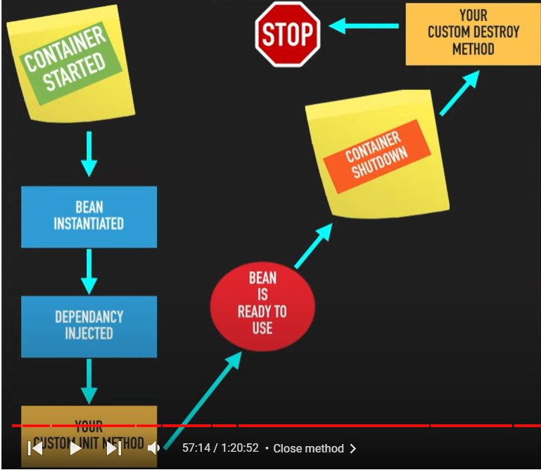

# @PostConstruct

- any method which is declared with annotation @PostConstruct is called init().
	By default framework calls the method.
- init() will be called in which @PostConstruct annotation will be their.
	Inside init method we will write those types of logics like connectingDb, connectingSocket etc...
- Once init() will be called only we can use those objects or else we can't use. 

## Init() can be called in 3 ways:
	
- By using @postConstruct annotation.(This is java way of calling init() we have to add javax jar file)
- 
```java
		@Bean(initMethod = "init")
		public Player player() {
			
			return new Player();
		}
```
		
- By implementing Class called InitializingBean and overide method called afterPropertiesSet.(This is spring way means it is tightly coupled with spring)
	
## What if we have both init() as well as implementing Class called InitializingBean?

- First afterPropertiesSet() will be called then only init() will be called.


# @PreDestroy 

- Over the method which is basically for cleaning stuff like closing connection, closing socket etc...
- i,e destroy method will be called before the Bean is removed from container.

## destroy() can be called in 3 ways:
	
- By using @preDestroy annotation.
	
- 
```java
		@Bean(destroyMethod = "destroy")
		public Player player() {
			
			return new Player();
		}
```
		
	
-  Below code internally uses autocloseable interface
	
```java
		try(AnnotationConfigApplicationContext container = new AnnotationConfigApplicationContext(AppConfig.class))
		// using try with resources and automatically it calls .close()
		{
		container.getBean(Teacher.class).teach();
		}
```
		
- java way of closing container i,e instruct JVM that hey JVM whenever u shutdown that tym close container.
		
```java
		AnnotationConfigApplicationContext container = new AnnotationConfigApplicationContext(AppConfig.class);
		container.getBean(Teacher.class).teach();
		container.registerShutdownHook();  
```
		
