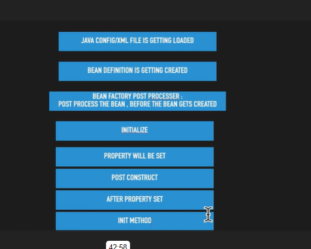
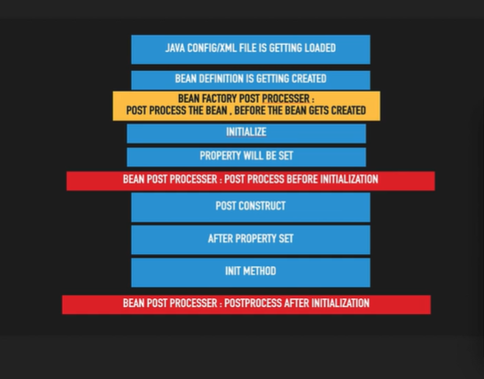

# BeanFactoryPostProcessor
		
	Before Bean get intialized i,e before constuctor is called , we can change the bean 
		definition by using BeanFactoryPostProcessor
		
	Java Config / XML file --> Bean Definition (Inside config class we define bean ryt i,e BeanDefinition ) --> CustomBeanPostProcessor --> Intialize --> DI --> PostConstruct --> afterPropertySet
	--> initMethod.

# BeanPostProcessor:
		
	After Bean Intializes then if we want change anything in Bean then BeanPostProcessor is used i,e 
		
	Before Bean Post Processor --> PostConstruct --> afterPropertySet
	--> initMethod.

		
	
### Y @Bean annotation is used eventhough we can create bean using @Component ?
	
	It is used in the case when we want Third party library into our project and create object of that ex: ModelMapper. 
	
	@Bean(autowireCandidate = false) --> basically tells that bean is not eligible for autowiring.