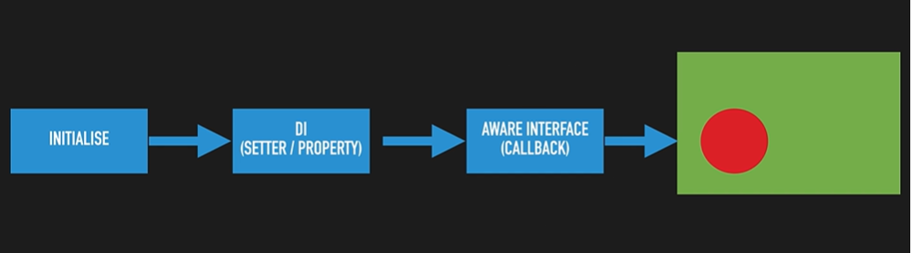

	
# AwareInterface

Aware is a marker interface it has some implemented class.
It is basically a callback method.
	
## Aware interface Implemented Class	
	Is it very tighly coupled with classes which we declare.
	
### BeanNameAware
	BeanNameAware is implemented class for Aware interface.
	
	It is basically used for setting bean name it is automatically called by spring framework.
	
### BeanFactoyAware
	By using BeanFactoyAware we can get information about bean. i,e to check whether bean is singleton by using beanFactory.isSingleton("");
	
### ApplicationContextAware
	By using ApplicationContextAware we can get bean it is same as BeanFactoyAware class.

	ApplicationContextAware has method called setApplicationContext.
	
### ResourceLoaderAware
	By using ResourceLoaderAware we can load resource i,e if we want to load a file and print those in console. 
	It has method called setResourceLoader which is automatically called

### MessageSourceAware
	By using MessageSourceAware it is used for achieving Internalization i,e changing language based on required.

## Y should we not use AwareInterface ?
	Since it is tightly coupled with Aware interfaces i,e If we remove spring jars it won't work.