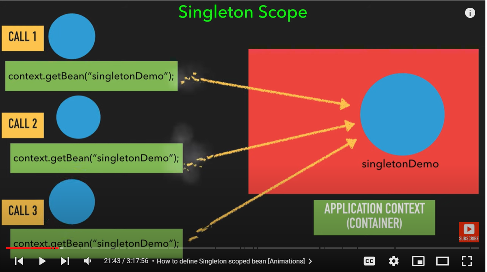
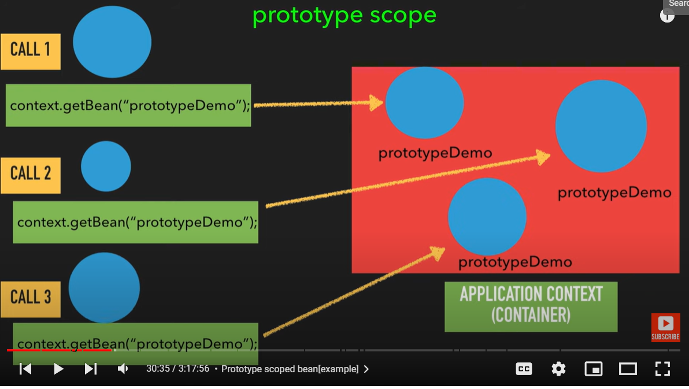

# Singleton Scope:


	
- Whenever we annotate a class with @Component its by default scope in Singleton and it will be eagerly intialized

- If we specify or don't specify i,e
```java
	@Scope("singleton") or 
	@Scope(value = ConfigurableBeanFactory.SCOPE_SINGLETON)
	
	SingletonDemo Obj1 =  applicationContext.getBean("singletonBean",SingletonDemo.class);	
	SingletonDemo Obj2 =  applicationContext.getBean("singletonBean",SingletonDemo.class);
	
	System.out.println(Obj1 == Obj2); // true
	
```
# Prototype Scope



- whenever we we annotate a class with @Component and if we use top of class i,e

```java
@Scope(value = ConfigurableBeanFactory.SCOPE_PROTOTYPE) 
```

- we always get new instance of object and it is lazily intialized.
	
- whenever we ask for bean then only we will get object.

```java	
	PrototypeDemo Obj1 =  applicationContext.getBean("prototypeDemo",PrototypeDemo.class); 
	PrototypeDemo Obj2 =  applicationContext.getBean("prototypeDemo",PrototypeDemo.class);
		
	System.out.println(Obj1 == Obj2); //false
```

# Singleton vs Prototype instantiation
	
## Note 
- If we mark any class as Prototype then whenever the ApplicationContext starts it will not instantiate any bean 
	marked with @Scope(value = ConfigurableBeanFactory.SCOPE_PROTOTYPE).
	
## Then when this class will get instantiate?

- Whenever we call for that particular class then only it will instantiate that class.

```java	
	Student student = applicationContext.getBean("student",Student.class);
```
- when we write this then only student object will be created.
	
	
### Imagine u have a class annotate with Singleton and that class has dependency of another class which is annotate with Prototype what will happen?

	
- whenever we annotate a method with @Lookup spring will overide that method and returns us new object always at runtime by the help of CGLib.

- Spring will create a subclass (cglib proxy) for School, it will overide and implement the method which is annotate with @Lookup.
	
	
## Spring's Singleton Scope Bean vs GOF Singleton Design Pattern (In core java what we have achieved)?

- GOF Singleton Design Pattern one object inside entire JVM.
	But in case of Spring Whenever we annotate class with @Component its a singleton scope one object for 1 ApplicationContext only.
	
# Spring web-aware Bean Scopes

- request,session,application and websocket i,e example (@Scope("request")) should be used only in case on Web-Application.
	
# Request Scope

	@Scope("request") --> For each request new object will be created.
	
- We will be getting unsatisfied dependency Exception.
	
	Y?
	---
	Whenever a new request is coming then only create bean object.
	
	i,e whenever Web-Application context is loaded controller object is created then it should inject dependency myBean but no request is coming 
	How will it create?
	
	So 
```java
	@Scope(value = "request",proxyMode = ScopedProxyMode.TARGET_CLASS) 
```
	
- First create proxy object for that i,e mybean and when we send a new request use this proxy object and create a actual pobject of mybean.
	
### Standard Way of defining request scope
	@Scope(value = WebApplicationContext.SCOPE_REQUEST,proxyMode = ScopedProxyMode.TARGET_CLASS) or @RequestScope
	