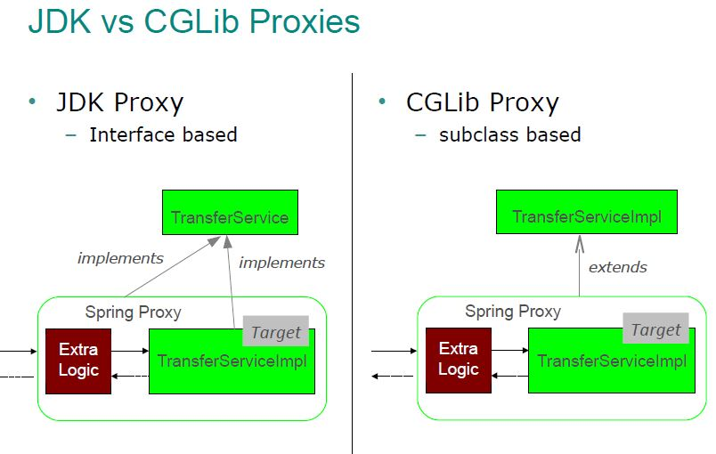

# Note: 
By Default all beans are Singleton.



# JDK Proxy:

```java
	EmployeeSalaryInvocationHandler empHandler = new EmployeeSalaryInvocationHandler(employee);
			
	Below line of code creates a JDK Proxy
	IEmployee employeeProxyCreated = (IEmployee)Proxy.newProxyInstance(
			ITEmployee.class.getClassLoader(), 
			new Class[] {IEmployee.class}, 
			empHandler);
			
	employeeProxyCreated.giveHike(5000); 
```


## Disadvantage of JDK Proxy:
- JDK proxy will work only with interface it won't work with classes.
- self Invocation i,e when a method calls another method inside JDK proxy doesn't support it.
	
## CGLib Proxy:
- CGLIB basically extends Target class and overides that method and invokes that method from child class.
	
### To overcome disadvantage of JDK Proxy.	
```java
		//creating product instance
		Product product = new Product();
		
		//creating proxy factory
		ProxyFactoryBean proxyFactoryBean = new ProxyFactoryBean();
		//givcing the product to factory
		proxyFactoryBean.setTarget(product);
		
		//getting object from factory
		
		// whenever we use class It returns a CGLIB proxy
		Product productProxy = (Product)proxyFactoryBean.getObject();
		productProxy.showProductInfo();
		
		//But Whenever we use interface it return JDKProxy
		
		//IProduct productProxy = (IProduct)proxyFactoryBean.getObject();
	
```
# Proof:

- Define config class (TestConfig)
```java

	@Configuration
	public class TestConfig {
	
	@Bean
	public Test test() {
		
		return new Test();
	}

}
```

### Inside main method() write below code:
```java
	ApplicationContext context = new AnnotationConfigApplicationContext(TestConfig.class);
```
	
- whenever we put debuuger inside TestConfig class inside Test() it internally uses CGLIB Proxy How ?

- What Spring does is it creates a new class called below:
```java
	public class TestConfigFiles$CGLib extends TestConfig {
	
	@overide
	public Test test() {
		
		// it does certain checks
		sup.test();
	}
	
	}
```
	
- Internally all this will be done by Spring Framework. 
	
## 2nd Way Of CGLIB Proxy:
	
```java

	public class RAM {
	
	private String size = "64Gb";
	private int price = 10000;
	
	
	public String getSize() {
		return size;
	}
	public void setSize(String size) {
		this.size = size;
	}
	public int getPrice() {
		return price;
	}
	public void setPrice(int price) {
		this.price = price;
	}
}

	public static void main(String[] args) {

		final RAM targetRam = new RAM();

		Enhancer enhancer = new Enhancer();
		enhancer.setSuperclass(targetRam.getClass());
		
		//anonymous class
		enhancer.setCallback(new MethodInterceptor() {
												// which ever method name     //MethodProxy has more functionalites then Method
		public Object intercept(Object obj, Method method, Object[] args, MethodProxy proxy) throws Throwable {

	    System.out.println("before invoking method");

		// method = getSize()
		Object ret = proxy.invokeSuper(obj, args); // which inturn calls actual method of RAM Class.
		System.out.println(ret);

		System.out.println("after invoking method");

		return ret;
	   }
	});

		//creating CGLib Proxy
		RAM ramProxy = (RAM) enhancer.create();

		ramProxy.getSize(); // which will call anonymous method called --> intercept()
		ramProxy.getPrice();
		
		//Internally spring is extending ur class and calling the method.
		// Just make ur class as final it won't be working because then it won't able to extend class.

	}
```
	
## What Spring Framework does internally is:

```java
	//
	//class RAM{
	//	
	//	void abc() {}
	//}
	//
	//Class RAMProxy extends RAM {
	//	
	//	@overqride
	//	void abc() {
	//		
	//	sup.abc();
	//		
	//	}
	//}
```
	
# Imagine u have a class annotate with Singleton and that class has dependency of another class which has scope of Prototype what will happen?

```java

		Example:
		---------
		Computer.java:
		-----------------
		
		@Component
		public class Computer {
			
			@Autowired
			private RAM ram; //LAZY

			public Computer() {
				
				System.out.println("Initializing computer");
			}

			public RAM getRam() {
				return ram;
			}

			public void setRam(RAM ram) {
				this.ram = ram;
			}
			
		}
		
		RAM.java:
		---------------
		
		@Component
		@Scope(value = "prototype")
		public class RAM {
	
		private int price = 100;
		private String size = "64GB";
		
		
		public RAM() {
			
			System.out.println("Intializing RAM");
		}


		public int getPrice() {
			return price;
		}


		public void setPrice(int price) {
			this.price = price;
		}


		public String getSize() {
			return size;
		}


		public void setSize(String size) {
			this.size = size;
		}
	}
```
	
- Since their is a need of RAM object so it creates, even though it is prototype scope.
- Spring Framework is creating normal RAM Object.
	
```java

	//below line of code will intialize both Computer and RAM Classes. 
	ApplicationContext context = new AnnotationConfigApplicationContext(TestConfig.class);
```
	
# But i don't want to create normal instead want to create CGLIBproxy object:
	
```java
	@Scope(value = "prototype",proxyMode = ScopedProxyMode.TARGET_CLASS)
```
	
- proxyMode = ScopedProxyMode.TARGET_CLASS ==>  which activates CGLib proxy.
	
- whenever singleton bean is created, a CGLIB proxy is getting assigned.
	
```java

		// line line of code will only intialize Computer Class 
		ApplicationContext context = new AnnotationConfigApplicationContext(TestConfig.class); 
		
		System.out.println("container loaded");
		
		// this line of code will be having computer class object which inturn has RAM CGLIB proxy object.
		Computer computer = context.getBean(Computer.class);
		
		RAM ram1 = computer.getRam(); // CGLIB proxy will call getRam() of Original class and get us original object.
		System.out.println(ram1); // when this line executes then only constructor will be called
		
		RAM ram2 = computer.getRam(); // returns new object
		System.out.println(ram2);
```
		
# TO assign JDKProxy for above code:
	
- Change RAM.java class to below code:

```java
	
	@Scope(value = "prototype",proxyMode = ScopedProxyMode.INTERFACES)
```	
- proxyMode = ScopedProxyMode.INTERFACES ==> It uses JDK Proxy.

```java	
	Computer.java:
	----------------
	@Component
	@Scope("singleton")
	public class Computer {
		
	@Autowired
	private IRAM ram; // using interface reference since JDKProxy won't work with classes

	public Computer() {
		
		System.out.println("Initializing computer");
	}

	public IRAM getRam() {
		return ram;
	}

	public void setRam(RAM ram) {
		this.ram = ram;
	}	
}

	RAM.java:
	-------------
	@Component
	@Scope(value = "prototype",proxyMode = ScopedProxyMode.INTERFACES)
	public class RAM implements IRAM {
		
	private int price = 100;
	private String size = "64GB";
	
	
	public RAM() {
		
		System.out.println("Intializing RAM");
	}


	public int getPrice() {
		return price;
	}


	public void setPrice(int price) {
		this.price = price;
	}


	public String getSize() {
		return size;
	}


	public void setSize(String size) {
		this.size = size;
	}

}
```

- Inside main() write below code:
```java
	AnnotationConfigApplicationContext container = new AnnotationConfigApplicationContext(ScopeConfig.class);

	System.out.println("container loaded");

	Computer computer = container.getBean(Computer.class);

	IRAM ram1 = computer.getRam();
	System.out.println(ram1);

	IRAM ram2 = computer.getRam();
	System.out.println(ram2);
```	
	
	
	
		

	
	
	