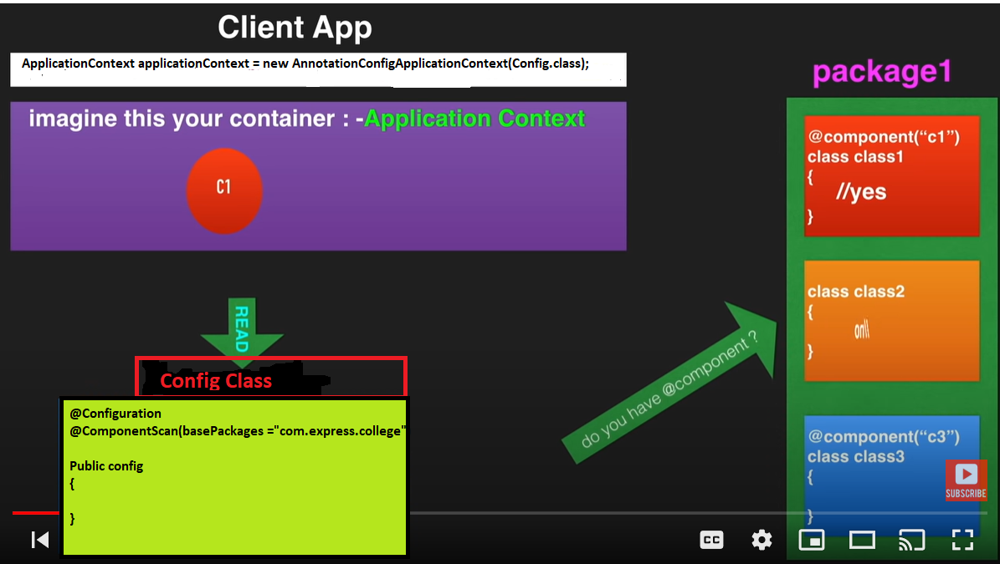

# If we delete XML file how can we achieve?

- @Configuration--> specify it is a configuration class
- First in Configuration class i,e

- First It reads the ConfigFile out of ConfigFile it creates the ApplicationContext.
	 
```java

	@Configuration
	@ComponentScan(basePackages = "com.express.college") 
	Public config
	{

	}

	@Component
	public class College
	{

	}
```
## Inside main method write below code:
	
```java
	ApplicationContext applicationContext = new AnnotationConfigApplicationContext(Config.class); 
	
	College college = applicationContext.getBean("college", College.class); // if we don't specify any name for component then by default name will be className
	 
	System.out.println("college bean is created" +college);
	
	college.test();

```
### 2nd way to create Bean
	
- @Bean--> It is also used for creating object

```java
	public class College{

	@Bean
	public College collegeBean() { // collegeBean is beanId


	College college = new College(); return college;
	}

	}
	 

	@Configuration
	@ComponentScan(basePackages = "com.express.college") 
	Public config{


	}


	//inside main method write below code 1st Approach:
	
	ApplicationContext applicationContext = new AnnotationConfigApplicationContext(Config.class); 
	
	College college = applicationContext.getBean("collegeBean", College.class);
	
	System.out.println("college bean is created" +college); college.test();
	
	((AnnotationConfigApplicationContext)applicationContext).close();

```
### 2nd Approach:
	
```java
	AnnotationConfigApplicationContext applicationContext = new AnnotationConfigApplicationContext(Config.class);
	
	College college = applicationContext.getBean("collegeBean", College.class); 
	
	System.out.println("college bean is created" +college);
	
	college.test();
	
	applicationContext.close();
```

- If we are using @Bean annotation we don't need to specify @ComponentScan annotation.